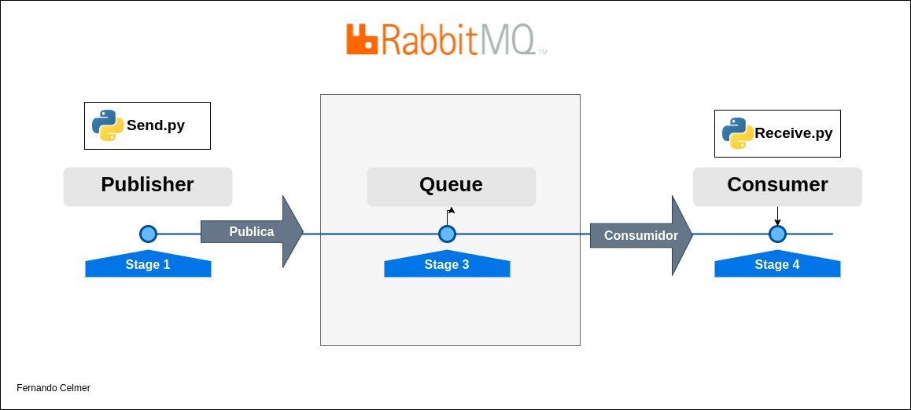

01 DE MARÇO, 2022 [**#02**]

---

## Introdução

Este é um pequeno review sobre a ferramente de mensageria RabbitMQ.

Para entender melhor sobre RabbitMQ primeiro é necessário entender o conceito de mensageria que é basicamente um modo de comunicação por meio de troca de mensagens e sendo gerenciados por um “Message Broker”, termo em inglês que define um software que possibilita que aplicativos, sistemas e serviços se comuniquem e troquem informações.

## RabbitMQ

Na documentação oficial do RabbitMQ tem um exemplo muito bom do conceito da ferramenta em si que seria um mediador/gerenciador de mensagens, simples assim. Pense no sistema sendo sendo como uma agência de correios. Quando você coloca uma correspondência em uma caixa postal, pode ter certeza de que o carteiro acabará entregando a correspondência ao seu destinatário. Nessa simples analogia o RabbitMQ é uma caixa postal e também a agência de correios que entregará a sua carta.

#### “Producing” / Produzir

<center>

![IMAGEM-01 — [Producing] — Produzir](x_img_02_01.png)

**IMAGEM-01 — [Producing] — Produzir**

</center>


Produzing termo que representa o envio de uma mensagem para que o software. Nesse nesse cenário poderíamos chamar esse software de produtor.

#### “Queues” / Fila

<center>

![IMAGEM-02 — [Queues] — Filas](x_img_02_02.png)

**IMAGEM-02 — [Queues] — Filas**

</center>

São nas Queues ou Filas que ficam armazenadas as mensagens enviadas pelo software “produtor”. Agora estamos falando do que é executado dentro do servidor RabbitMQ que pode limitar-se pela sua memória e tamanho em disco disponibilizado pelo host.

#### “Exchanges” / Trocas

Exchanges ou Trocas é o processo de distribuição das mensagens para as suas respectivas filas. O direcionamento das mensagens depende do algoritmo de roteamento usado que é especificado nas mensagens recebidas.

#### “Consumers” / Consumidores

<center>

![IMAGEM-03 — [Consumers] — Consumidores](x_img_02_03.png)

**IMAGEM-03 — [Consumers] — Consumidores**

</center>

Consumers são uma parte importante do esquema geral da estrutura do RabbitMQ, porque são eles, os “Consumidores” que irão executar determinados processos. É nesse momento que o processo descrito na mensagem é consumido e processado.


#### Fluxo Básico

<center>



**IMAGEM-04 — Diagrama simplificado do fluxo do RabbitMQ**

</center>

#### Exemplo em Python

`Send.py`

```
# coding=utf-8
import pika
import environ

env = environ.Env()
environ.Env.read_env()
rabbitmq_url = env("RABBITMQ_URL")

params = pika.URLParameters(rabbitmq_url)
connection = pika.BlockingConnection(params)

channel = connection.channel()

channel.queue_declare(queue='intro_rabbitmq')

channel.basic_publish(exchange='', routing_key='intro_rabbitmq', body='Ola Mundo!')
print(" [x] Enviado 'Ola Mundo!'")
connection.close()
```

`Receive.py`

```
# coding=utf-8
import pika, sys, os
import environ

def main():
env = environ.Env()
environ.Env.read_env()
rabbitmq_url = env("RABBITMQ_URL")

params = pika.URLParameters(rabbitmq_url)
connection = pika.BlockingConnection(params)

channel = connection.channel()

channel.queue_declare(queue='intro_rabbitmq')

def callback(ch, method, properties, body):
    print(" [x] Recebido %r" % body)

channel.basic_consume(queue='intro_rabbitmq', on_message_callback=callback, auto_ack=True)

print(' [*] Esperando mensagem. Aperte CTRL+C para sair')
channel.start_consuming()

if name == 'main':
try:
main()
except KeyboardInterrupt:
print('Interrompido')
try:
sys.exit(0)
except SystemExit:
os._exit(0)
```

A maior parte deste conteúdo foi retirado do site oficial do RabbitMQ, para ter acesso a tópicos mais complexos acesse [www.rabbitmq.com](www.rabbitmq.com).

---

**Mais informações**

- [Rabbitmq Docs](https://www.rabbitmq.com/documentation.html)
- [Message brokers](https://www.ibm.com/br-pt/cloud/learn/message-brokers)
- [Github Gist Source Code - Receive.py](https://gist.github.com/FernandoCelmer/9d7ca86b55344725beab9d6e17b60c98)
- [Github Gist Source Code - Send.py](https://gist.github.com/FernandoCelmer/b004afed646a0042719fd487aae27a2c)